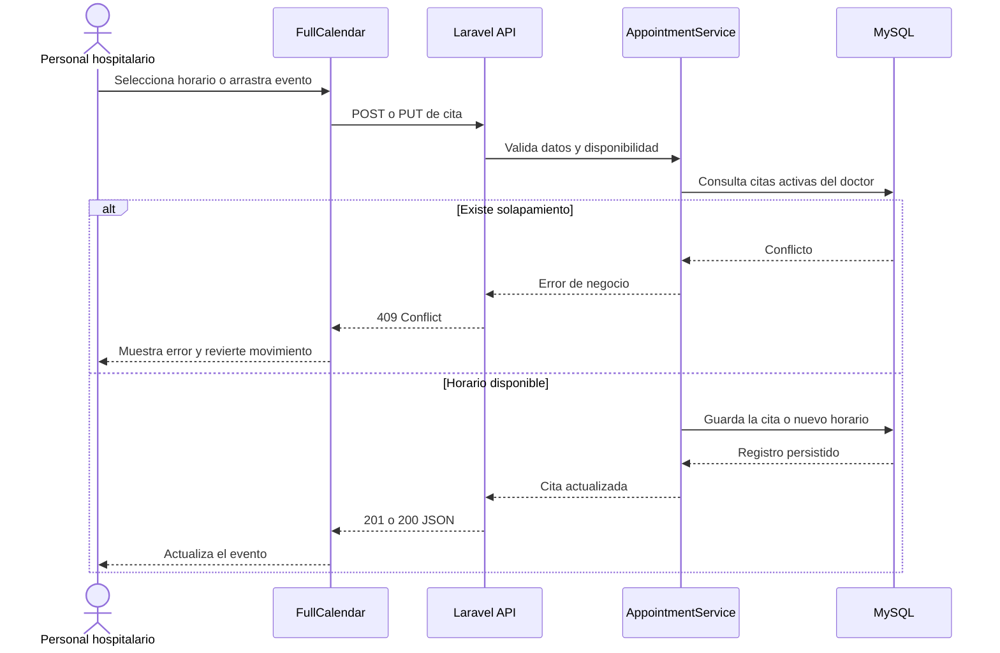

# Flujo de creacion y reprogramacion

```mermaid
sequenceDiagram
    actor User as Personal hospitalario
    participant Calendar as FullCalendar
    participant API as Laravel API
    participant Service as AppointmentService
    participant DB as MySQL

    User->>Calendar: Selecciona horario o arrastra evento
    Calendar->>API: POST o PUT de cita
    API->>Service: Valida datos y disponibilidad
    Service->>DB: Consulta citas activas del doctor

    alt Existe solapamiento
        DB-->>Service: Conflicto
        Service-->>API: Error de negocio
        API-->>Calendar: 409 Conflict
        Calendar-->>User: Muestra error y revierte movimiento
    else Horario disponible
        Service->>DB: Guarda la cita o nuevo horario
        DB-->>Service: Registro persistido
        Service-->>API: Cita actualizada
        API-->>Calendar: 201 o 200 JSON
        Calendar-->>User: Actualiza el evento
    end
```
