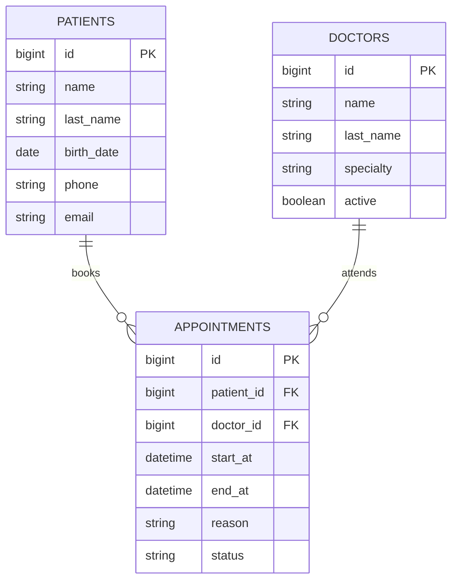

# Modelo entidad-relacion

```mermaid
erDiagram
    PATIENTS ||--o{ APPOINTMENTS : books
    DOCTORS ||--o{ APPOINTMENTS : attends

    PATIENTS {
        bigint id PK
        string name
        string last_name
        date birth_date
        string phone
        string email
    }

    DOCTORS {
        bigint id PK
        string name
        string last_name
        string specialty
        boolean active
    }

    APPOINTMENTS {
        bigint id PK
        bigint patient_id FK
        bigint doctor_id FK
        datetime start_at
        datetime end_at
        string reason
        string status
    }
```
