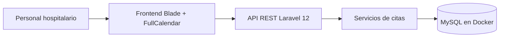

# Diagrama de contexto

```mermaid
flowchart LR
    U[Personal hospitalario]
    F[Frontend Blade + FullCalendar]
    A[API REST Laravel 12]
    S[Servicios de citas]
    D[(MySQL en Docker)]

    U --> F
    F --> A
    A --> S
    S --> D
```

El usuario interactua con el calendario. El frontend consume la API y la API delega las reglas de negocio a los servicios antes de persistir en MySQL.
